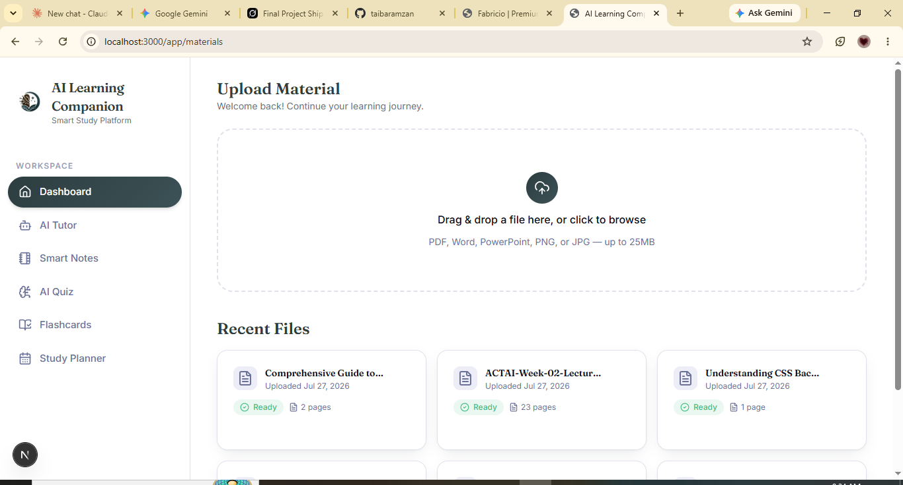
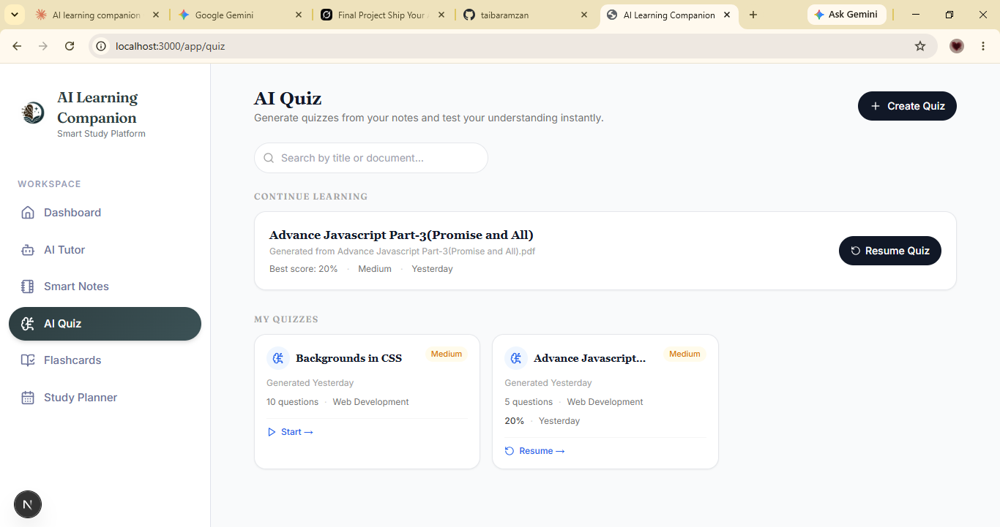

# AI Learning Companion

An AI-powered study platform that turns any course material — PDF, Word doc, PowerPoint, or even a photo of notes — into an interactive learning experience: a RAG-grounded AI tutor that answers questions using only your uploaded content, auto-generated quizzes and flashcards, and a spaced-repetition study planner.

**The problem it solves:** Students (myself included) end up with scattered PDFs, slide decks, and screenshots from different courses and no fast way to actually study from them — you either re-read everything or make flashcards by hand. This app lets a student upload their real material once and get a tutor, quiz set, and flashcard deck generated directly from it, grounded in what was actually taught (not generic AI knowledge).

**Who it's for:** University/college students juggling multiple courses who want an efficient way to review and self-test on their own lecture notes and readings.

---

## 🔗 Live Demo

**URL:**


---

## ✨ Features

- **Material upload** — drag-and-drop or browse to upload PDF, Word, PowerPoint, PNG, or JPG files (up to 25MB)
- **Automatic processing** — OCR (for scanned/image content), text chunking, embedding generation, and vector storage per document
- **AI Tutor (RAG chat)** — ask questions about your uploaded material and get answers grounded in that material, not generic AI knowledge
- **Smart Notes** — condensed, structured notes generated from your uploaded files
- **AI Quiz generator** — auto-generated quizzes based on document content
- **Flashcards** — auto-generated flashcard decks for spaced review
- **Study Planner** — spaced-repetition scheduling across all uploaded materials
- **Authentication** — Email/Password and Google sign-in via Firebase
- **Recent files dashboard** — track upload status (processing/ready) and page counts per document


---

## 🤖 AI Feature — How It Works

**What it does:** 

**System prompt used:**

``
You are the AI Tutor inside AI Learning Companion, a study app that helps
students learn from their own uploaded course material (PDFs, slides,
Word docs, and images).

You will be given:
1. A student's question
2. Retrieved excerpts from the student's own uploaded documents (the "context")

Rules you must follow:
- Answer using ONLY the information in the provided context. Do not use
  outside knowledge to fill gaps, even if you know the answer.
- If the context does not contain enough information to answer the
  question, say so clearly (e.g. "Your uploaded material doesn't cover
  this — you may want to check your lecture notes or ask your
  instructor.") Do not guess or make up an answer.
- When you answer, point to where the information came from (e.g.
  "According to page 4 of [Document Name]...") so the student can
  verify it themselves.
- Explain concepts at the level of a student encountering the material
  for the first time — clear, simple language, short paragraphs,
  and examples where useful. Avoid unnecessary jargon.
- If the student's question is ambiguous or could refer to multiple
  documents, ask a brief clarifying question before answering.
- Never fabricate quotes, page numbers, or facts that aren't in the
  provided context.
- Keep responses focused and study-relevant — you are a tutor, not a
  general-purpose chatbot.
```

**Model/provider used:** OpenAI GPT-4-class model for chat, `text-embedding-3-large` for embeddings.
You are a quiz generator inside AI Learning Companion. You will be
given excerpts from a student's uploaded course material.

Generate a quiz that:
- Is based ONLY on the provided content — do not introduce facts,
  terms, or concepts that aren't in the material.
- Includes a mix of question types (multiple choice, short answer)
  unless the student specifies otherwise.
- Covers the material broadly rather than repeatedly testing the
  same section.
- For each question, includes the correct answer and a one-sentence
  explanation referencing the source material.
- Matches the difficulty to the complexity of the source content —
  don't invent harder concepts than what's actually covered.

Return the output as structured JSON with fields: question, type,
options (if multiple choice), correct_answer, explanation.

---

## 🛠️ Tools, Services & Stack

**Frontend:** Next.js 15 (App Router), TypeScript, Tailwind CSS, shadcn-style components, Framer Motion, Zustand, TanStack Query

**Backend:** FastAPI, Motor (async MongoDB driver), Pydantic

**Auth:** Firebase Authentication (client SDK + Admin SDK token verification)

**Database:** MongoDB Atlas

**Vector DB:** Pinecone (dimension 3072, cosine similarity)

**File storage:** Cloudinary

**AI:** OpenAI (chat + embeddings), LangChain, LangGraph agents

**Deployment:** Vercel (frontend), Render (backend)

**CI:** GitHub Actions — lint/type-check/build (frontend), pytest (backend) on every PR

---

## 📸 Screenshots

_Add at least 3 screenshots showing the app in actual use. Save them into a `docs/screenshots/` folder in your repo and reference them like this:_

| Dashboard / Upload | AI Tutor Chat | Quiz / Flashcards |
|---|---|---|
|  |


  |

  |

  |


> Tip: crop out browser chrome/other tabs, and make sure any visible data isn't sensitive.

---

## 🚀 How to Run Locally

### Prerequisites (real accounts required — nothing here is mocked)

1. **Firebase project** — enable Email/Password + Google sign-in. Download a service-account JSON (Project Settings → Service Accounts) for the backend, and copy the web app config for the frontend.
2. **MongoDB Atlas cluster** — create a free/shared cluster, get the connection string, whitelist your IP (or `0.0.0.0/0` for dev).
3. **Pinecone account** — create an index with dimension `3072` (matches `text-embedding-3-large`), metric `cosine`.
4. **Cloudinary account** — get cloud name, API key, API secret.
5. **OpenAI API key** with access to a GPT-4-class model.

### Backend

```bash
cd backend
python -m venv .venv && source .venv/bin/activate
pip install -r requirements.txt
cp .env.example .env        # fill in real credentials
# place your Firebase service account JSON at the path set in FIREBASE_CREDENTIALS_PATH
uvicorn app.main:app --reload --port 8000
```

Visit `http://localhost:8000/api/docs` for the live Swagger UI.

### Frontend

```bash
cd frontend
npm install
cp .env.example .env.local  # fill in real Firebase web config + API URL
npm run dev
```

Visit `http://localhost:3000`.

### Testing

```bash
# backend
cd backend && pytest -q

# frontend
cd frontend && npm run lint && npm run type-check
```

---

## ☁️ Deployment

- **Frontend → Vercel:** import the repo, set root directory to `frontend`, add the same env vars as `.env.local`.
- **Backend → Render:** new Web Service, root directory `backend`, build command `pip install -r requirements.txt`, start command `uvicorn app.main:app --host 0.0.0.0 --port $PORT`, add the same env vars as `.env`.
- CI runs lint/type-check/build (frontend) and pytest (backend) on every PR via `.github/workflows/ci.yml`.

---

## 📂 Project Structure

See `docs/phase-1-architecture.md` for the full architecture, sitemap, and data model.

## 🧩 Build Status

- [x] Phase 1 — Architecture
- [x] Project scaffolding (frontend + backend, auth wiring)
- [x] Documents module (upload, OCR, chunking, embeddings, Pinecone)
- [x] RAG chat
- [x] Notes
- [x] Quiz generator
- [x] Flashcards
- [x] Study planner

> _Before submitting, update this checklist to reflect what's actually finished — grading is based on working features, not planned ones._
